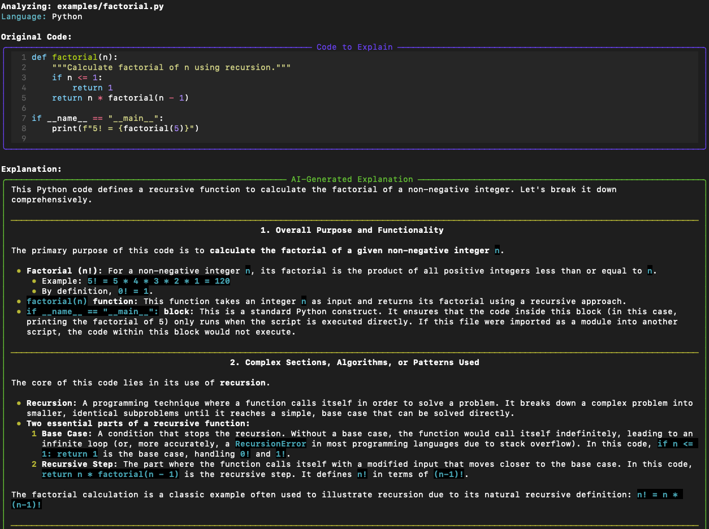
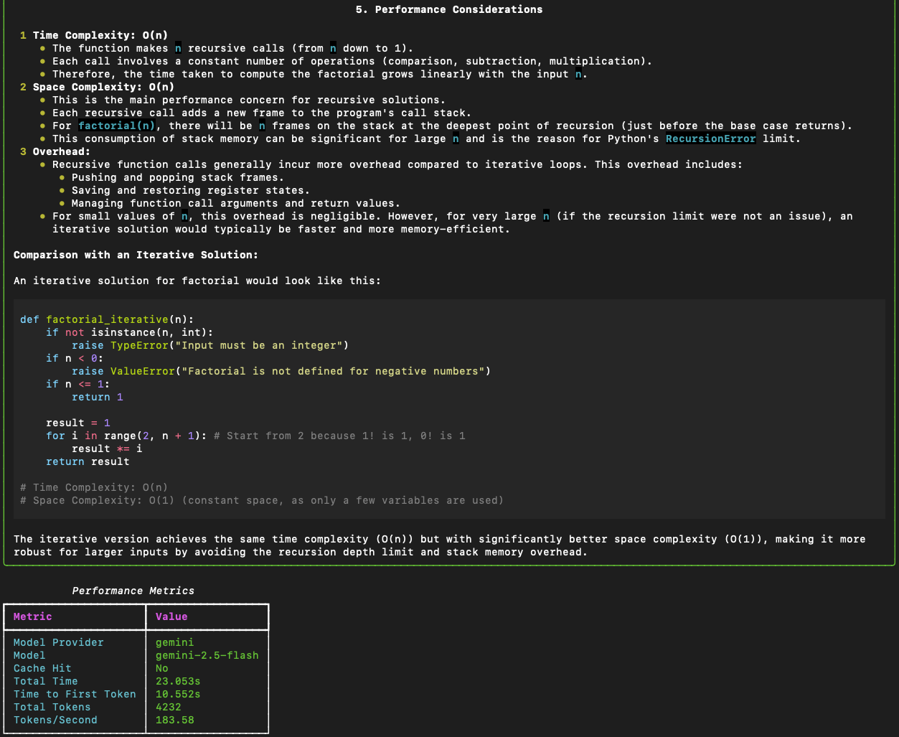

# CodeInsight CLI: Production-Grade Code Analysis

[](https://www.python.org/downloads/)
[](https://opensource.org/licenses/MIT)
[](https://aistudio.google.com/)
[](https://ollama.com/)

**CodeInsight CLI** is a robust, production-ready developer tool designed to provide high-fidelity code explanations using a hybrid AI architecture. By bridging the gap between high-performance cloud models (Google Gemini) and privacy-focused local execution (Ollama), CodeInsight ensures you have intelligent code analysis available anywhere, anytime, with zero downtime.

---

## 🚀 Key Highlights

*   **Hybrid-Edge Intelligence**: Dynamic routing between Google Gemini (Cloud) and Ollama (Local/Edge) for maximum reliability.
*   **Production-Grade Caching**: Persistent SHA-256 disk caching to eliminate redundant API costs and latency.
*   **Structured AI Validation**: Pre-flight LLM-powered sanity checks to ensure input integrity before processing.
*   **Observability First**: Real-time performance tracking (tokens/sec, prefill latency, decoding speed).
*   **Developer Experience**: Rich terminal UI with real-time markdown streaming and syntax highlighting.

### User Interface Demo


*Real-time markdown streaming with syntax highlighting.*


*Performance observability metrics for cloud and local providers.*

---

## 🏗️ Architecture & Engineering Principles

### 1. Resilient Hybrid Model Routing
CodeInsight implements a "Cloud-First, Local-Fallback" strategy. While cloud APIs offer superior speed and quality, local models provide privacy and offline capability.
- **Failover Logic**: Automatic switching to local execution if API quotas are hit or network connectivity is lost.
- **Provider Agnostic**: Abstracted provider layer allows for seamless integration of new models.

### 2. Intelligent Pre-flight Validation
To optimize resource usage and prevent "garbage-in/garbage-out" scenarios, CodeInsight uses a lightweight LLM validator as a guardrail.
- **Structured Output**: Uses Pydantic to enforce schema-strict validation results from the LLM.
- **Cost Efficiency**: Detects non-code/gibberish before incurring the cost of a full-scale explanation.

### 3. High-Performance Observability
Built with the philosophy that "you can't optimize what you don't measure," the CLI tracks:
- **Prefill Latency**: Time to First Token (TTFT).
- **Decoding Speed**: Tokens per second.
- **Context Efficiency**: Total token consumption and cache hit rates.

---

## 📂 Project Structure

```text
CodeInsight-CLI/
├── src/
│   ├── core/           # Business logic & Provider Orchestration
│   ├── providers/      # Implementation for Cloud (Gemini) & Edge (Ollama)
│   ├── models/         # Pydantic-enforced Data Schemas
│   ├── prompts/        # Engineered Prompt Templates
│   ├── cli/            # Rich Terminal Interface handlers
│   └── config.py       # Centralized Environment Management
├── examples/           # Targeted usage scenarios
├── .cache/             # Persistent disk-cache layer
└── cli.py              # Single entry-point executable
```

---

## 🛠️ Getting Started

### Prerequisites
- Python 3.13+
- [uv](https://github.com/astral-sh/uv) (Highly recommended for dependency management)

### Installation
1. **Clone & Initialize**
   ```bash
   git clone https://github.com/brianchanbc/CodeInsight-CLI.git
   cd CodeInsight-CLI
   ```

2. **Sync Dependencies**
   ```bash
   uv sync
   ```

3. **Configure Environment**
   ```bash
   cp .env.example .env
   # Add your GEMINI_API_KEY to .env for cloud features
   ```

### Local AI Setup (Optional)
For offline capabilities, install [Ollama](https://ollama.com) and pull the recommended lightweight model:
```bash
ollama pull llama3.2:1b
```

---

## 💻 Usage

### Analyze a Single File
Generate a high-fidelity explanation with real-time streaming:
```bash
uv run cli.py explain -i examples/factorial.py -l Python
```

### Batch Analysis (Directory Level)
Document an entire module efficiently:
```bash
uv run cli.py explain -i ./src/core -o ./docs -l Python --pattern "*.py"
```

### Advanced Controls
- **Provider Override**: `--provider ollama` forces local execution.
- **Export**: `-o results.md` saves the high-quality markdown output.
- **Observability**: `--no-metrics` to simplify output for standard usage.

---

## 🗺️ Roadmap

- [ ] **Semantic Caching**: Using vector embeddings to detect and reuse explanations for refactored code (same logic, different syntax).
- [ ] **Async Batching**: Concurrent file processing for large-scale codebase documentation.
- [ ] **IDE Integration**: VSCode/JetBrains extensions for inline code intelligence.
- [ ] **Benchmarking Suite**: Automated quality scoring across different model providers.

---

## 🤝 Contributing
Contributions are welcome! Please feel free to submit a Pull Request.

## 📄 License
This project is licensed under the MIT License - see the [LICENSE](LICENSE) file for details.
