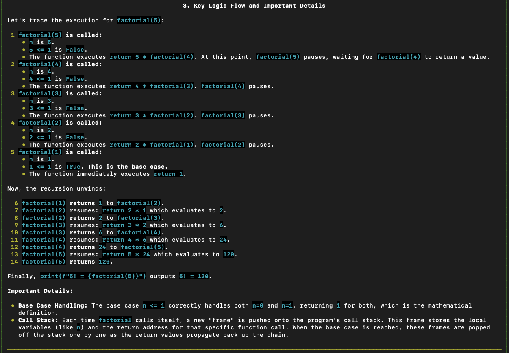
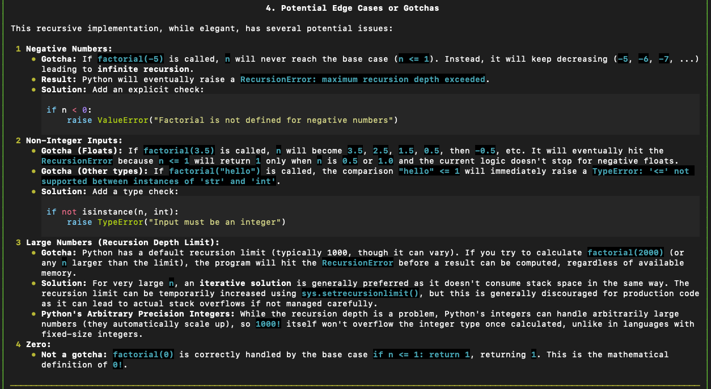

# AI-Powered Code Explanation CLI Tool

A CLI tool that uses ML models (Gemini and Llama) to generate comprehensive explanations of source code. 

## Features

- **Multiple ML Providers**: Supports Gemini (cloud) and Llama (local via Ollama) models
- **Automatic Fallback**: Seamlessly switches providers if one fails
- **Streaming Output**: Real-time explanation generation with live markdown rendering
- **Intelligent Caching**: 7-day disk cache for instant repeated explanations
- **Input Validation**: LLM-powered validation to detect gibberish/non-code
- **Performance Metrics**: Track latency, tokens, and provider performance
- **Multi-file Analysis**: Run analysis in batches
- **Beautiful CLI**: Rich terminal UI with syntax highlighting and progress indicators
- **Type-Safe**: Full type hints throughout with Pydantic validation

## Project Structure

```
ml-cli/
├── src/
│   ├── __init__.py
│   ├── config.py           # Configuration management
│   ├── core/               # Business logic
│   │   ├── __init__.py
│   │   └── explainer.py    # Main CodeExplainer service
│   ├── providers/          # ML provider implementations
│   │   ├── __init__.py
│   │   ├── base.py         # Abstract provider interface + exceptions
│   │   ├── gemini.py       # Google Gemini provider
│   │   └── ollama.py       # Ollama local provider
│   ├── models/             # Data models (Pydantic + dataclasses)
│   │   ├── __init__.py
│   │   └── models.py       # ExplanationResult, PerformanceMetrics, ValidationResult
│   ├── prompts/            # Prompt templates
│   │   ├── __init__.py
│   │   └── prompts.py      # Explanation and validation prompts
│   └── cli/                # Command-line interface logic
│       ├── __init__.py
│       ├── commands.py     # CLI command handlers
│       └── formatters.py   # Rich output formatting
├── examples/               # Sample code files for testing
│   ├── factorial.py
│   └── binary_search.py
├── images/                 # Demo images for README
├── .cache/                 # Disk cache (auto-created)
├── .env                    # Environment variables (to store Gemini API key)
├── .env.example            # Example environment variables 
├── .gitignore
├── cli.py                  # Main CLI entry point
├── pyproject.toml          # Project dependencies
├── uv.lock                 # Dependency lock file
└── README.md               # This file
```

## Setup Instructions

### Prerequisites

- Python 3.13+ 
- For Gemini: Google API key 
- For Ollama: Ollama model installed and running locally

### Installation

1. **Clone the repository**
   ```bash
   git clone <repository-url>
   cd ml-cli
   ```

2. **Install dependencies** (using uv - recommended)
   ```bash
   # Install uv if you don't have it
   curl -LsSf https://astral.sh/uv/install.sh | sh

   # Install project dependencies
   uv sync
   ```

3. **Set up environment variables**
   ```bash
   # Create .env file
   cp .env.example .env

   # Edit .env and add your API key
   GEMINI_API_KEY=your_api_key_here
   ```

### Obtaining Google Gemini API Keys

#### Google Gemini (Free Tier)

1. Visit [Google AI Studio](https://aistudio.google.com/app/apikey)
2. Sign in with your Google account
3. Click "Get API Key" -> "Create API Key"
4. Copy the key and add to `.env` file

Beware of Free Tier limitations

### Setting Up Locally-hosted Ollama Model 

#### Ollama (Local - No API Key Needed)

1. Install Ollama: [https://ollama.com/download](https://ollama.com/download) or use brew to install it
   ```bash
   brew install ollama
   ```
2. Pull a model:
   ```bash
   ollama pull llama3.2:1b  # Lightweight model (1.3GB)
   ```
3. Start Ollama server:
   ```bash
   brew services start ollama # Method 1
   ollama serve # Method 2
   ```

**Recommended**: Use Gemini for quality, Ollama as fallback

## Usage

### Check Available Providers

```bash
uv run python cli.py providers
```

#### Output:
```
Available Providers:
✓ gemini
✓ ollama
```

### Explain a Single File

```bash
# Basic usage
uv run python cli.py explain -i examples/factorial.py -l Python

# Save explanation to file
uv run python cli.py explain -i examples/factorial.py -l Python -o explanation.md

# Use specific provider (default is Gemini if not specified)
uv run python cli.py explain -i examples/factorial.py -l Python --provider ollama

# Hide performance metrics
uv run python cli.py explain -i examples/factorial.py -l Python --no-metrics
```

### Explain Multiple Files (Directory)

```bash
# Explain all Python files in a directory
uv run python cli.py explain -i ./examples -o ./explanations -l Python --pattern "*.py"

# Explain only specific files
uv run python cli.py explain -i ./examples -o ./explanations -l Python --pattern "factorial.py"
```

#### Output:

```bash
uv run python cli.py explain  -i examples/factorial.py -l Python --provider gemini
```





### Usage Help

```bash
uv run python cli.py --help
```

## Configuration

Edit `src/config.py` to customize:

```python
class Settings:
    # Provider settings
    default_provider: str = "gemini"
    gemini_model: str = "gemini-2.5-flash"
    ollama_model: str = "llama3.2:1b"

    # Cache settings
    cache_enabled: bool = True
    cache_ttl: int = 604800  # 7 days

    # Validation settings
    min_code_length: int = 10
    max_code_length: int = 100_000 # Maximum characters
    validation_sample_size: int = 1000 # First how many words for validation

    # Generation settings
    explanation_temperature: float = 0.7 # Higher to allow more flexibility
    explanation_max_tokens: int = 8192
    validation_temperature: float = 0.3 # Lower as we want more deterministic checks
    validation_max_tokens: int = 512
```

## Design Decisions and Trade-offs

### 1. **Code Explanation Over Other ML Tasks**
**What we prioritized**: Code explanation over unit test generation, security scanning, optimization suggestions, or language conversion

**Why explanation won**:
- **Unit tests**: May not cover test cases comprehensively, needs human verification anyway
- **Security vulnerabilities**: Static analysis tools already exist and are more reliable and faster - LLMs produce inconsistent results
- **Code optimization**: Hard to benchmark and evaluate, could lead to over-engineering on a simple solution
- **Language conversion**: Syntax translation is deterministic - better handled by transpilers (e.g. TypeScript compiler)
- **Code explanation**: Pure LLM strength - natural language generation, output expected to be evaluated and used by humans immediately anyway

**Rationale**: LLMs excel at understanding context, patterns, and algorithmic complexity. They explain "why" and "how" code works, not just "what" it does. Traditional static analysis identifies functions and variables, but LLMs explain recursion depth, time complexity, design patterns, and architectural decisions.

**The key insight**: Explanations don't need to be "correct" in a strict sense - they need to be helpful. Unlike tests or security fixes which must be accurate, explanations provide value even if 80% accurate.

### 2. **Hybrid Architecture Over Single Provider**
**What we prioritized**: Supporting both cloud API (Gemini) and local model (Ollama) over a single provider

**What we sacrificed**: Simpler codebase with one provider implementation

**Why hybrid won**:
- **Gemini (cloud)**: Fast, high-quality explanations, free tier available, zero local setup
- **Ollama (local)**: Privacy-preserving, no API costs, works offline, unlimited usage, fast response when running on optimal devices, allows switching to different local models at ease should more use cases arise in the future
- **Resilience**: If Gemini hits rate limits or network interruption → automatic fallback to Ollama (no workflow interruption)
- **Real-world scenario**: On a flight with no WiFi? Ollama allows you to run model for code explanation to continue your development work

**The tradeoff**: More complexity in provider abstraction vs. flexibility, resilience, and never being blocked by a single provider's limitations

### 3. **Performance Metrics Over Feature Development**
**What we prioritized**: Comprehensive observability (model metadata, latency, tokens, caching) over building more features

**What we sacrificed**: Time that could have been spent on interactive mode, web UI, or additional providers

**Why metrics won**:
- **Time to first token**: Measures prefilling performance during inference (compute-bound)
- **Tokens/second**: Measures decoding performance during inference (memory-bound)
- **Total tokens**: Track API costs (matters if we switch to paid models), model efficiency and usage
- **Total time**: Compare overall latency of model inference between providers
- **Cache hit rate**: Validate caching effectiveness
- **Provider comparison**: Compare Gemini vs different open-source models performance, identify slow explanations
- **Hardware optimization**: Optimize prefilling and decoding during inference by using different machines for local models

**The tradeoff**: CLI interface (developer-friendly) with observability enables future optimization vs interactive UI development

### 4. **Disk Cache Over Advanced Caching Strategies**
**What we prioritized**: Simple SHA256 disk cache with 7-day TTL over semantic similarity caching or Redis

**What we sacrificed**:
- Semantic cache hits (similar code gets same explanation)
- Distributed caching for multi-machine setups
- LRU/LFU eviction strategies

**Why simple disk cache won**:
- **Persistent**: Cache survives restarts (unlike in-memory), which is important as CLI script ends after each run
- **Cost savings**: Avoid redundant API calls for repeated code
- **Speed**: Cache hit is almost instantaneous 
- **Size**: Disk-based scales better than memory caching
- **Zero dependencies**: No Redis/Memcached setup required
- **Developer workflow**: Developers often re-explain the same files during debugging sessions across days

**The tradeoff**: Lost ~20% potential cache hits (similar code) but kept implementation simple, minimal disk I/O overhead, and dependencies minimal

### 5. **Input Validation Over Output Filtering**
**What we prioritized**: Pre-LLM input validation over post-LLM output quality checks

**What we sacrificed**:
- Hallucination detection
- Explanation quality scoring

**Why input validation won** (given time constraints):
- **Cost efficiency**: Prevent wasting tokens on gibberish input (cheaper to validate 100 chars than generate 500 tokens)
- **Fail fast**: Immediate feedback if input is invalid vs waiting 30s for bad output
- **Simpler implementation**: Easier to validate whether a script is a code-piece than whether the output is what the user is looking for
- **Modern LLMs are reliable**: Gemini 2.5/Llama 3.2 rarely hallucinate on code explanation

**The tradeoff**: No output quality validation (hallucination detection) vs. implementation simplicity. Saved significant development time and API costs.

### 6. **Sequential Batch Processing Over Async/Concurrent**
**What we prioritized**: Support for directory-level batch processing with pattern matching, but using simple sequential file processing over concurrent/async implementation

**What we sacrificed**: 5-10x speedup for directory explanations

**Why sequential batch processing won** (for now):
- **Real-world use case**: Developers need to understand entire modules/packages, not just single files
- **Productivity**: Explain 10 files in one command vs. 10 separate commands
- **Documentation generation**: Automatically generate explanation.md files for all source files
- **Implementation simplicity**: Async adds significant complexity (asyncio, provider refactoring)
- **Rate limits**: Concurrent requests could hit API limits faster
- **Resource constraints**: Local Ollama benefits less from concurrency (CPU/GPU bound)
- **MVP focus**: Get working solution first, optimize later

**The tradeoff**: Sequential processing slower than async. Explaining 100 files may take 5 minutes vs 30 seconds, but saved development time on async implementation


## Future Developments

### Addressing Trade-off Weaknesses

1. **Output Quality Validation** (from Trade-off #5)
   - **Problem**: Currently no hallucination detection or explanation quality scoring
   - **Solution**: Implement post-generation validation using second LLM or heuristics
   - **Why it matters**: Catch incorrect explanations before user sees them, especially for critical codebases
   - **Implementation**: Create LLM judge in the output validation layer for sanity check and integrate more comprehensive evaluation testing before deployment. 

2. **Async Batch Processing** (from Trade-off #6)
   - **Problem**: 100 files may take 5 minutes sequentially vs. 30 seconds with async
   - **Solution**: Implement asyncio-based concurrent processing with rate limiting
   - **Why it matters**: Dramatically improve speedup for large codebases (entire repos)
   - **Implementation**: Async provider calls, semaphore for rate limiting (external API calls), progress bar for status tracking

3. **Semantic Caching** (from Trade-off #4)
   - **Problem**: Lost ~20% potential cache hits for similar code
   - **Solution**: Use embeddings to find semantically similar code snippets
   - **Why it matters**: Functions with renamed variables or slight refactoring could reuse explanations
   - **Implementation**: Store embeddings in vector DB, retrieve top-k similar codes, reuse explanation if similarity > 0.9

4. **IDE/Code Editor Integration** (from Trade-off #3)
   - **Problem**: Currently CLI-only workflow requires context switching and manual file selection
   - **Solution**: Build IDE extensions (VSCode) with inline code explanation
   - **Why it matters**: Enable developers to get explanations without leaving their editor, right-click on code selection for instant explanations
   - **Implementation**: Integrate with VSCode as a starting point

5. **Model Provider Benchmarking**
   - **Problem**: No systematic way to compare quality and performance across different providers and models
   - **Solution**: Build benchmarking suite that evaluates explanations on standard code datasets
   - **Why it matters**: Make data-driven decisions on which models to use for different scenarios (speed vs quality), identify differences when updating models
   - **Implementation**: Create test dataset with ground-truth explanations, measure scores or run LLM judge that compares quality, track latency/tokens metrics, generate comparison reports 

### Code Quality Improvements

6. **Comprehensive Testing**
   - **Unit tests**: Mock providers, test fallback logic, validate metrics collection
   - **Integration tests**: End-to-end explanation flow, cache behavior, error handling

7. **Structured Logging and Observability**
   - **Current issue**: Minimal system logging, there is conflict in system logs with outputs to be shown to users on the CLI. 
   - **Solution**: System logs should be captured in a small metrics database
   - **Benefits**: Debug system issues

## Assumptions Made

1. **Input Assumptions**
   - Code is UTF-8 encoded 
   - Files are text-based (no binary files)
   - Code is complete (not fragments with missing context)
   - Maximum file size: 100KB (configurable)

2. **Provider Assumptions**
   - Gemini API is accessible (not behind corporate firewall)
   - Device is capable to run Ollama server and models locally
   - Models support streaming
   - Both providers return text

3. **Security Assumptions**
   - No malicious code injection in prompts

4. **Usage Assumptions**
   - Single user 
   - Internet connection available for Gemini
   - English language code 

## Troubleshooting

### CLI interface stops in the middle of generation
- This is not an issue, please wait for a few more seconds for it to complete the rendering towards the end. This is due to the Rich library's UI needing time to determine it is time to stop and wrap the terminal interface. 

### Input validation blocking despite using a valid script
- This is due to the input model filtering sometimes being too strict and flagging false positives. Re-run the command. 

### "No providers available"
- **Gemini**: Check `GEMINI_API_KEY` in `.env` file
- **Ollama**: Ensure `brew services start ollama` or `ollama serve` is running

### "Rate limit exceeded"
- Wait 60 seconds and retry
- Switch to Ollama: `--provider ollama`
- Check Gemini quota: [AI Studio](https://aistudio.google.com)

### "Model not found" (Ollama)
```bash
# Pull the model
ollama pull llama3.2:1b

# Verify it's available
ollama list
```

### Cache Issues
```bash
# Clear cache
rm -rf .cache

# Disable cache temporarily
# Edit src/config.py: cache_enabled = False
```

